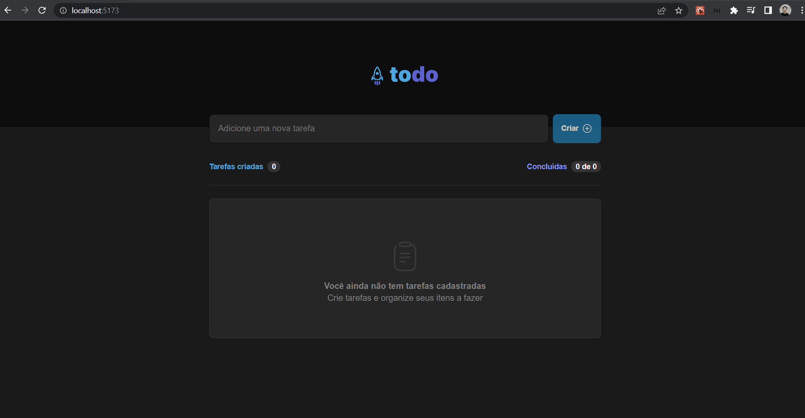

# Desafio-01 - Vite TodoList

Criação de uma aplicação de lista de tarefas usando React iniciando projeto com Vite

## Instruções

1. Baixar o projeto usando `https://github.com/tonoliveira96/ignite-trilha-reactjs.git`
2. Acessar a pasta `ignite-trilha-reactjs-2022/01-fundamentos-react/desafio-01`
2. Rodar no terminal `npm i` para instalar as depêmdemcia.
4. Rodar no terminal `npm run dev` para rodar o projeto.
5. Acessar no navegador `http://localhost:5173/`.

## Tela
