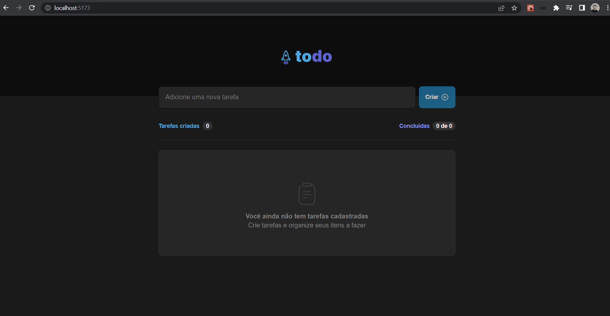

# Desafio-01 - Vite TodoList

Criação de uma aplicação de lista de tarefas usando React iniciando projeto com Vite

## Descrição
Nesse desafio, você vai desenvolver uma aplicação de controle de tarefas no estilo **to-do list**, que contém as seguintes funcionalidades:

- Adicionar uma nova tarefa
- Marcar e desmarcar uma tarefa como concluída
- Remover uma tarefa da listagem
- Mostrar o progresso de conclusão das tarefas

## Ferramentas e conceitos
- Estados
- Imutabilidade do estado
- Listas e chaves no React Native
- Propriedades
- Componentização

## Instruções
1. Baixar o projeto usando `https://github.com/tonoliveira96/ignite-trilha-reactjs-2022.git`
2. Acessar a pasta `projeto-01/desafio-01`
2. Rodar no terminal `npm i` para instalar as depedência.
4. Rodar no terminal `npm run dev` para rodar o projeto.
5. Acessar no navegador `http://localhost:5173/`.

## Tela
