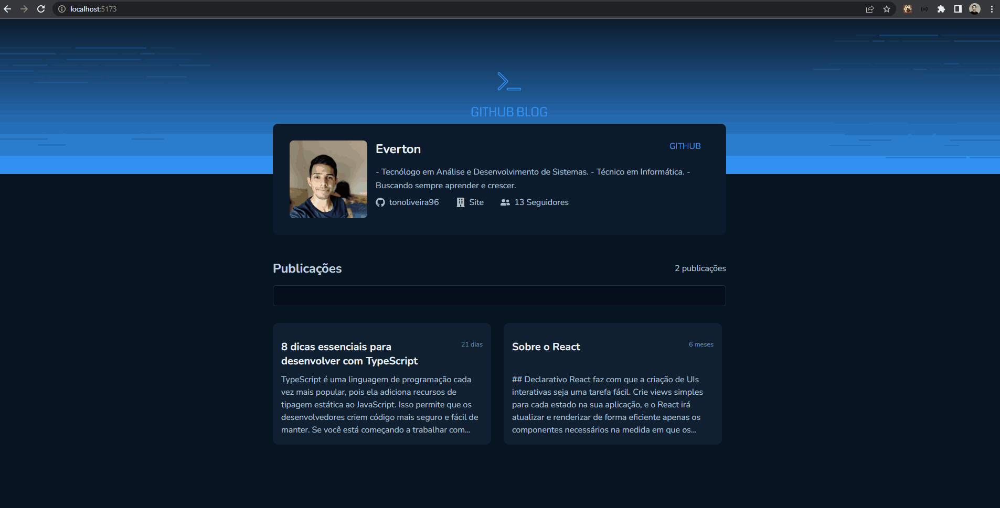

# Desafio 03 - Github Blog

## Descrição
Nesse desafio, você vai desenvolver uma aplicação que utilizará da API do GitHub para buscar issues de um repositório, dados do seu perfil e exibir elas como um blog.

- Listagem do seu perfil com imagem, número de seguidores, nome e outras informações disponíveis pela API do GitHub.
- Listar e filtrar todas as issues do repositório com um pequeno resumo do conteúdo dela
- Criar uma página para exibir um post (issue) completo

## Ferramentas e conceitos
- Fetch / Axios
- Roteamento e React Router DOM
- Formulários

## Instruções
1. Baixar o projeto usando `https://github.com/tonoliveira96/ignite-trilha-reactjs.git`
2. Acessar a pasta `projeto-03/desafio-03`
2. Rodar no terminal `npm i` para instalar as depedência.
4. Rodar no terminal `npm run dev` para rodar o projeto.
5. Acessar no navegador `http://localhost:5173/`.

## Tela
